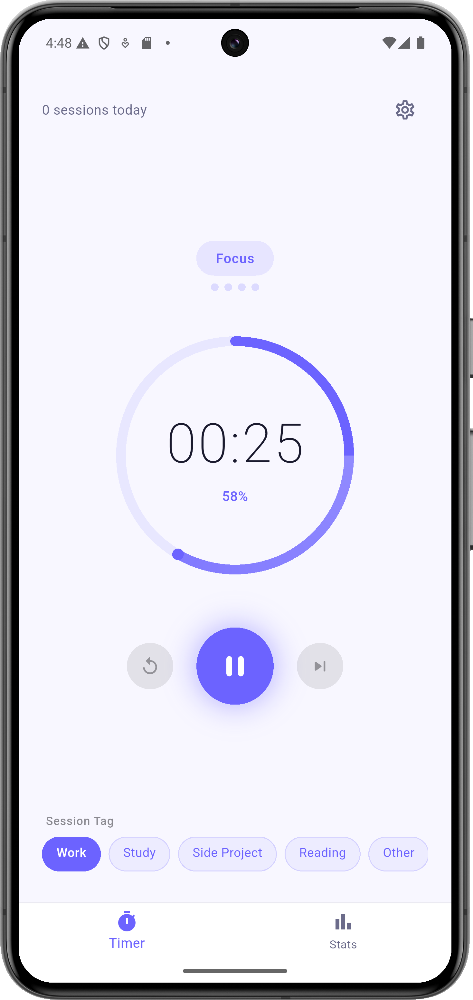
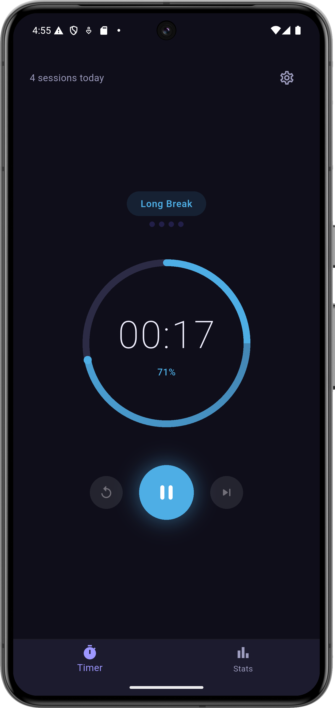
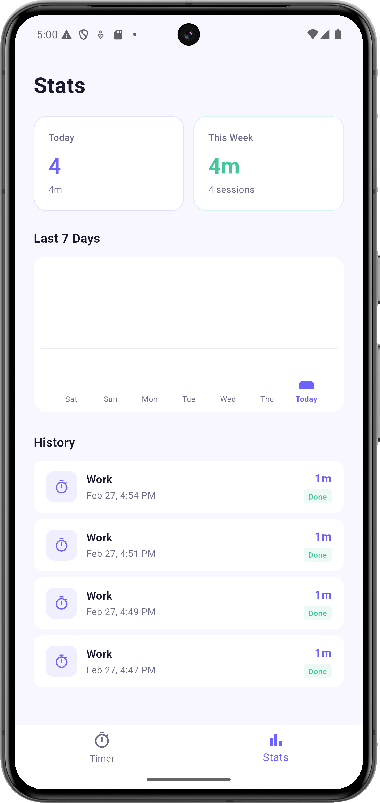
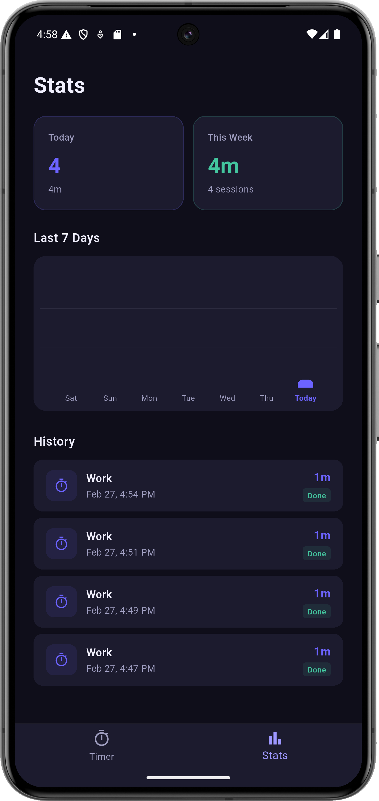
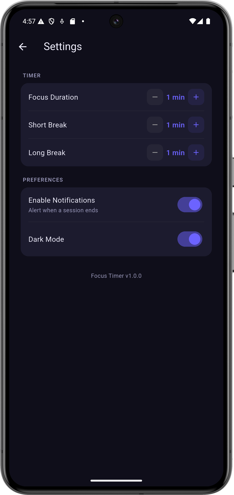

# Focus Timer

A clean, production-grade productivity timer built with Flutter. Designed to demonstrate real-world Flutter architecture and engineering patterns for a professional portfolio.

---

## Features

- **Pomodoro Cycle** — Automatic work → short break → work → long break cycling with no manual intervention
- **Animated Timer Ring** — Hand-drawn `CustomPainter` progress ring with sweep gradient and a leading-edge dot
- **Session Tagging** — Tag every focus session before starting (Work, Study, Side Project, Reading, Other)
- **Persistent History** — Every completed session saved locally to SQLite via Floor
- **Weekly Stats** — Bar chart showing daily focus minutes over the last 7 days
- **Local Notifications** — Alerts you when a session ends, even when the app is in the background
- **Configurable Durations** — Adjust work, short break, and long break lengths from Settings
- **Dark Mode** — Full dark theme with persisted preference across app restarts
- **Clean Architecture** — Strict separation of domain, data, and presentation layers

---

## Screenshots

<p float="left">
  
  
  
  
  
  
</p>

---

## Architecture

This project follows **Clean Architecture** with a feature-first folder structure. Each feature owns its full vertical slice from database to UI.

```
lib/
├── core/
│   ├── constants/        # Colors, strings, durations
│   ├── errors/           # Failure types
│   ├── services/         # NotificationService
│   ├── usecases/         # Abstract UseCase base class
│   └── utils/            # Ticker, TimeFormatter
│
├── database/
│   ├── app_database.dart # Floor @Database definition
│   ├── app_database.g.dart
│   └── session_dao.dart  # Floor @Dao
│
├── features/
│   ├── timer/
│   │   └── presentation/
│   │       ├── bloc/     # TimerBloc, TimerEvent, TimerState
│   │       ├── screens/  # TimerScreen
│   │       └── widgets/  # TimerRing, TimerControls, TagSelector, SessionTypeLabel
│   │
│   ├── session/
│   │   ├── data/
│   │   │   ├── datasources/
│   │   │   ├── models/   # SessionModel (@Entity)
│   │   │   └── repositories/
│   │   ├── domain/
│   │   │   ├── entities/ # Session (pure Dart)
│   │   │   ├── repositories/ # Abstract interface
│   │   │   └── usecases/ # SaveSession, GetTodaySessions, GetWeeklySessions, GetAllSessions
│   │   └── presentation/
│   │       ├── bloc/     # SessionBloc, SessionEvent, SessionState
│   │       ├── screens/  # StatsScreen
│   │       └── widgets/  # StatsSummary, WeeklyChart, SessionHistoryList
│   │
│   └── settings/
│       ├── data/         # SettingsLocalDatasource (SharedPreferences)
│       ├── domain/
│       │   └── entities/ # AppSettings
│       └── presentation/
│           ├── cubit/    # SettingsCubit, SettingsState
│           ├── screens/  # SettingsScreen
│           └── widgets/  # DurationPicker, ToggleRow
│
├── service_locator.dart  # GetIt dependency injection
├── app_theme.dart        # Light and dark ThemeData
├── app.dart              # Root widget, routing, theme binding
└── main.dart
```

### Layer Rules

| Layer | Rule |
|-------|------|
| `domain` | Pure Dart only. Zero Flutter or Floor imports. Fully unit-testable in isolation. |
| `data` | Implements domain interfaces. Owns Floor models, DAOs, and datasources. |
| `presentation` | Blocs and Cubits talk to use cases only, never directly to the database. |

### State Management

| Bloc / Cubit | Responsibility |
|---|---|
| `TimerBloc` | Countdown logic, session cycling, pause/resume, session tagging |
| `SessionBloc` | Saving sessions to Floor, loading history, powering the stats screen |
| `SettingsCubit` | All user preferences — durations, notifications, dark mode |

---

## Tech Stack

| Package | Version | Purpose |
|---------|---------|---------|
| `flutter_bloc` | ^8.1.3 | State management |
| `bloc` | ^8.1.2 | Core Bloc library |
| `floor` | ^1.4.2 | SQLite persistence (type-safe ORM) |
| `shared_preferences` | ^2.2.2 | Settings persistence |
| `flutter_local_notifications` | ^16.1.0 | Session complete alerts |
| `fl_chart` | ^0.66.0 | Weekly focus bar chart |
| `get_it` | ^7.6.4 | Dependency injection |
| `equatable` | ^2.0.5 | Value equality for states and entities |
| `intl` | ^0.18.1 | Date formatting in history list |

---

## How It Works

### Timer Engine

The countdown is powered by a `Ticker` class that wraps `Stream.periodic`, emitting
one integer per second counting down from the session duration to zero. A
`StreamSubscription` in `TimerBloc` listens to this stream and fires a `TimerTicked`
event each second. Pause and resume work by pausing and resuming the subscription —
no cancellation and recreation, which keeps the remaining time perfectly intact.

### Session Persistence Flow

```
TimerBloc (timer hits zero)
  └── fires SaveSessionEvent
        └── SessionBloc._onSaveSession
              └── SaveSession use case
                    └── SessionRepositoryImpl
                          └── SessionLocalDatasourceImpl
                                └── SessionDao.insertSession → SQLite

              └── auto-fires LoadSessionsEvent
                    └── queries today + weekly + all sessions
                          └── emits SessionLoaded → StatsScreen rebuilds
```

Stats update automatically the moment a session completes. No manual refresh needed.

### Pomodoro Cycle

```
Work → Short Break → Work → Short Break → Work → Short Break → Work → Long Break → repeat
```

Four work sessions trigger a long break. The cycle counter persists in `TimerBloc`
state for the lifetime of the app session.

---

## Getting Started

### Prerequisites

- Flutter SDK ≥ 3.0.0
- Dart ≥ 3.0.0

### Setup

```bash
git clone https://github.com/yourusername/focus_timer.git
cd focus_timer
flutter pub get
flutter run
```

The Floor generated file (`app_database.g.dart`) is committed to the repo so no
code generation step is needed to run the project.

If you modify any Floor entities or DAOs, regenerate with:

```bash
dart run build_runner build --delete-conflicting-outputs
```

---

## Engineering Highlights

**Custom `CustomPainter` timer ring** — The animated ring is hand-drawn using
`Canvas.drawArc` with a `SweepGradient` shader. A dot at the arc's leading edge is
positioned using `cos` and `sin` against the sweep angle. No third-party widget.

**Ticker-driven Bloc** — The `Ticker` class exposes a `Stream<int>` via
`Stream.periodic`. The `TimerBloc` holds a `StreamSubscription` to this stream,
which it pauses and resumes on demand. This pattern cleanly separates timing
concerns from state logic and makes the Bloc trivially testable with a mock ticker.

**Domain layer isolation** — Every file inside a `domain/` folder has zero Flutter
or Floor imports. The `Session` entity is a plain Dart class. Use cases depend only
on abstract repository interfaces. This means the entire business logic layer can
be unit tested without a Flutter test environment.

**Automatic stats refresh** — `SessionBloc` chains `SaveSessionEvent →
LoadSessionsEvent` internally. The stats screen never needs to manually trigger a
reload — it simply rebuilds whenever `SessionBloc` emits a new `SessionLoaded` state.

**Settings applied instantly** — `SettingsScreen` holds references to both
`SettingsCubit` and `TimerBloc`. When a duration changes, it calls
`SettingsCubit` to persist and `TimerBloc.updateDurations()` to apply immediately.
No app restart required.

---

## License

MIT
